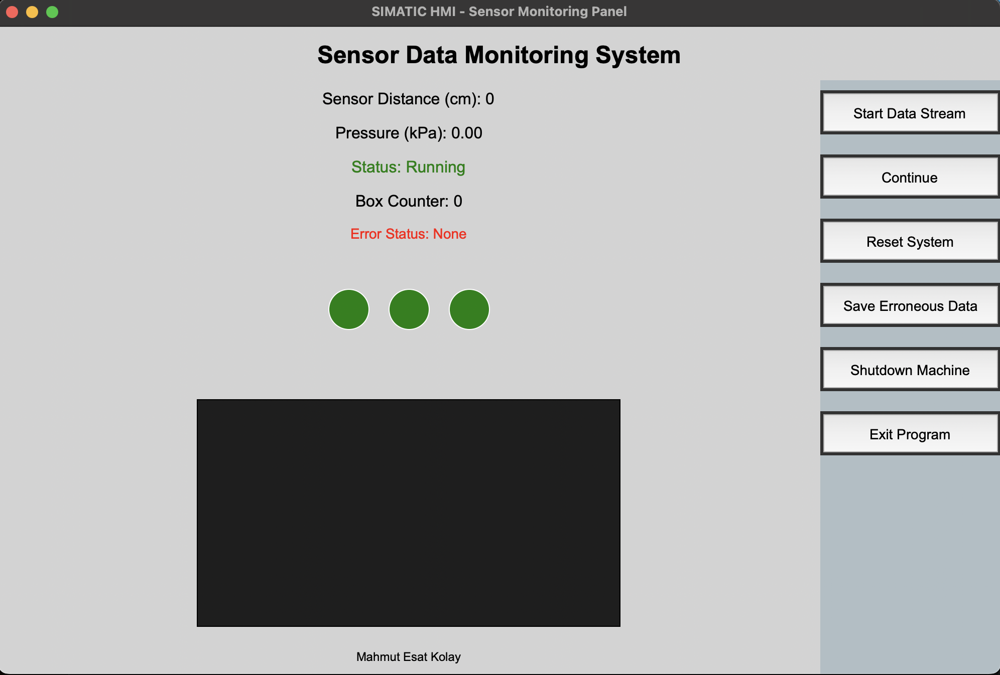

# Sensor Monitoring and Fault Detection System

This project is an AI-powered monitoring system developed for monitoring sensor data and detecting faults in an industrial environment. The system provides real-time monitoring and analysis of sensor data through a SIMATIC HMI-like interface.

## 🚀 Features

- Real-time sensor data monitoring
- AI-powered fault detection
- Visual LED indicators
- Error logging system
- Excel format error reporting
- User-friendly interface

## 📋 Requirements

The following Python libraries are required to run the project:

```bash
pandas
scikit-learn
joblib
tkinter
```

## 🛠️ Installation

1. Clone the project:
```bash
git clone [https://github.com/MEK-0/Sensor-Monitoring-and-Fault-Detection-System.git]
```

2. Install required libraries:
```bash
pip install -r requirements.txt
```

3. Train the model:
```bash
python model.py
```

4. Start the application:
```bash
python GUI.py
```

## 📁 Project Structure

- `GUI.py`: Main application interface and functionality
- `model.py`: AI model training and management
- `generate_sensor_data.py`: Sensor data generation for testing
- `sensor_model.pkl`: Trained model file
- `sensor_data.csv`: Training data

## 🔍 System Components

### 1. Data Generation (`generate_sensor_data.py`)
- Sensor distance: 5-6 cm normal, 5% chance between 6-40 cm
- Pressure: 249.57-400 kPa normal, 3% chance between 100-249.56 kPa

### 2. AI Model (`model.py`)
- Model trained using RandomForestClassifier
- Predictions based on sensor distance and pressure data
- 80-85% accuracy rate

### 3. User Interface (`GUI.py`)
- Real-time data monitoring
- LED indicators:
  - Machine status (Green/Red)
  - Pressure status (Green/Red)
  - Distance status (Green/Red)
- Control buttons:
  - Start Data Stream
  - Continue
  - Reset System
  - Save Erroneous Data
  - Shutdown Machine
  - Exit Program

#### User Interface Screenshot



*The main interface of the application. You can monitor real-time sensor data, see the status LEDs, and control the system using the buttons on the right.*

## ⚙️ Usage

1. Start data stream using the "Start Data Stream" button
2. Sensor data is monitored in real-time
3. System automatically stops in case of error
4. Data stream can be continued using the "Continue" button
5. Erroneous data can be saved in Excel format using the "Save Erroneous Data" button

## 🎯 Fault Detection

The system detects the following conditions as errors:
- When sensor distance is greater than 6 cm
- When pressure drops below 249.57 kPa
- When abnormal conditions are detected by the model

## 📊 Data Format

### Sensor Data (sensor_data.csv)
- sensor_distance: Sensor distance (cm)
- pressure: Pressure value (kPa)

### Error Report (erroneous_data.xlsx)
- Error index
- Error type
- Error values

## 👨‍💻 Developer

Mahmut Esat Kolay - https://www.linkedin.com/in/mahmutesatkolay/

## 📝 License

This project is licensed under the MIT License. 
